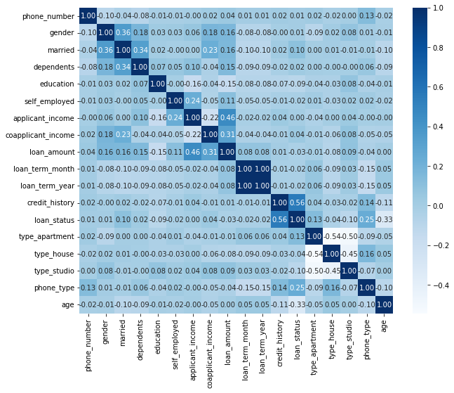

# Improving Machine Learning Performance

Improving machine learning model performance for predicting loan status. 

Task : Classification

## Requirements
* Python 3.7 or above
* Modules:
  * pandas
  * numpy
  * seaborn
  * matplotlib
  * scipy
  * sklearn
  * datetime
  * imblearn

## Dataset
The dataset used in this experiment :

## Steps to Improve Classification Model
* Feature Engineering
* Oversampling
* Hyper-parameter Tuning

## Classification Model
In the main experiment (with the aim of improving model performance), we performed a comparison between the 2 models:
* Decision Tree
* Random Forest

We also tried to see the performance of other models (with default hyperparameter):
* Logistic Regression
* Support Vector Machine Linear (SVC)
* Gradient Boosting
* Ada Boost
* K-Nearest Neighbors
* Gaussian Naive Bayes
* Multinomial Naive Bayes
* LightGBM
* XGBoost
* Multi Layer Perceptron

## Data Cleansing
* Handling duplicate values
* Handling missing values
* Handling outlier

## Feature Encoding and Preprocessing
* Label encoder
* One hot encoder

## The Result
* Correlation Matrix
 
* The Result of Experiment
* ROC Curve
* Feature Importance
* The Other Experiment Results

