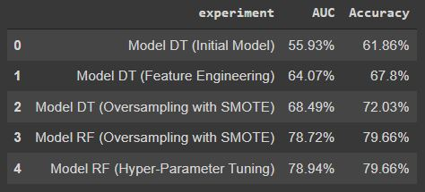
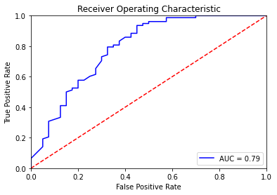
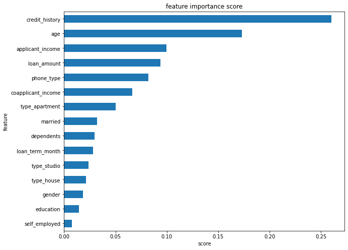

# Improving Machine Learning Performance

Improving machine learning model performance for predicting loan status. 

Task : Classification

## Requirements
* Python 3.7 or above
* Modules:
  * pandas
  * numpy
  * seaborn
  * matplotlib
  * scipy
  * sklearn
  * datetime
  * imblearn

## Dataset
The dataset used in this experiment : (https://github.com/nzlul03/improving_ML_performance/blob/main/loan_approval.csv)

## Steps to Improve Classification Model
* Feature Engineering
* Oversampling
* Hyper-parameter Tuning

## Classification Model
In the main experiment (with the aim of improving model performance), we performed a comparison between the 2 models:
* Decision Tree
* Random Forest

We also tried to see the performance of other models (with default hyperparameter):
* Logistic Regression
* Support Vector Machine Linear (SVC)
* Gradient Boosting
* Ada Boost
* K-Nearest Neighbors
* Gaussian Naive Bayes
* Multinomial Naive Bayes
* LightGBM
* XGBoost
* Multi Layer Perceptron

## Data Cleansing
* Handling duplicate values
* Handling missing values
* Handling outlier

## Feature Encoding and Preprocessing
* Label encoder
* One hot encoder

## The Result
* Correlation Matrix 

 

* The Result of Experiment

* ROC Curve

* Feature Importance

## The Other Experiment Results

|       ML Algo       |      AUC      |    Accuracy   |
|---------------------|---------------|---------------|
| Logistic Regression |     64.01     |     59.32     |
|         SVC         |     62.08     |     43.22     |
|    Decision Tree    |     68.49     |     72.03     |
|    Random Forest    |     78.72     |     79.66     |
|  Gradient Boosting  |     79.39     |     78.81     |
|      Ada Boost      |     75.93     |     77.97     |
|         KNN         |     46.06     |     49.15     |
|      GaussianNB     |     64.9      |     64.41     |
|    MultinomialNB    |     42.31     |     41.53     |
|        LGBM         |     79.71     |     79.66     |
|       XGBoost       |     77.85     |     79.66     |
|         MLP         |     45.99     |     31.36     |

